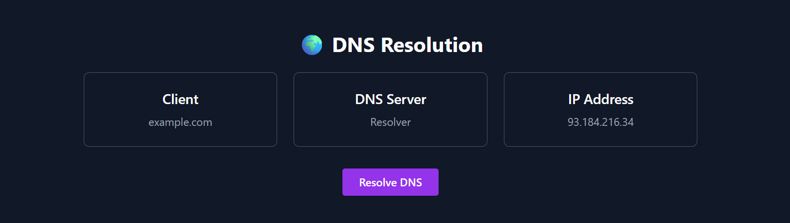
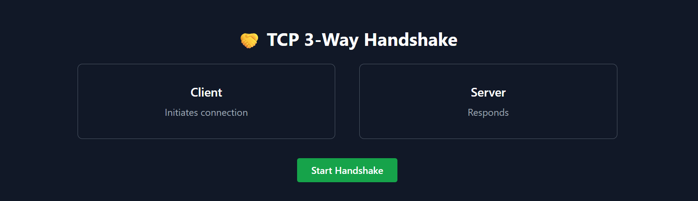

# 🌐 Computer Networks Visual Lab

An interactive web-based project to visualize core **Computer Networks concepts** using animations and simulations.

This project is designed to help students and beginners understand how network communication works behind the scenes.

---

## 🚀 Features

- 📡 **HTTP Request Flow Visualization**
- 🌍 **DNS Resolution Simulation**
- 🤝 **TCP 3-Way Handshake (SYN → SYN-ACK → ACK)**
- 📊 **HTTP Status Code Explorer**
  - 200 OK
  - 301 Redirect
  - 404 Not Found
  - 500 Internal Server Error

---

## 🛠️ Tech Stack

- **HTML** — Structure
- **Tailwind CSS** — Styling & animations
- **JavaScript** — Logic & interactivity
- **Computer Networks concepts**

---

## 🎯 Learning Outcomes

- Understand client–server communication
- Visualize DNS resolution process
- Learn TCP connection establishment
- Interpret HTTP status codes
- Strengthen frontend + CN fundamentals

  
## 📸 Project Screenshots

### 🔗 HTTP Request Flow 

### 🌐 DNS Resolver 

### 🤝 TCP 3-Way Handshake

### 📊 HTTP Status Code Explorer

