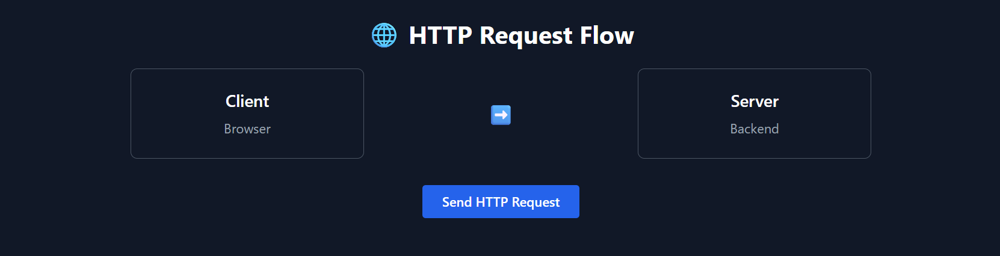
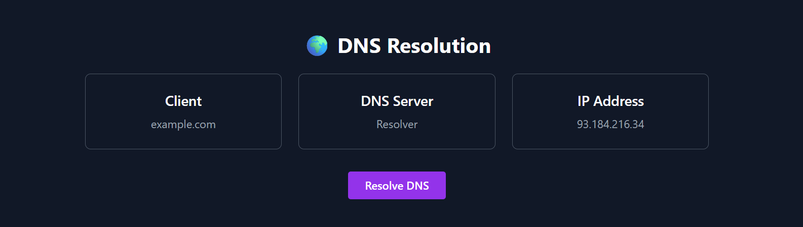
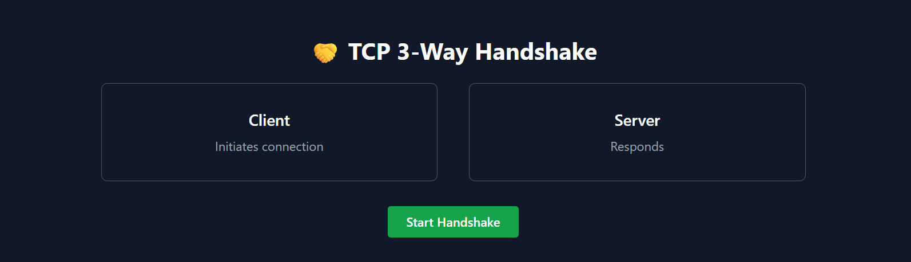

# 🌐 Computer Networks Visual Lab

An interactive web-based project to visualize core **Computer Networks concepts** using animations and simulations.

This project is designed to help students and beginners understand how network communication works behind the scenes.

---

## 🚀 Live Demo

🌐 **Live Website:** [Computer Networks Visual Lab](https://cn-visual-lab.vercel.app/)


---

## 📖 Project Overview

Computer Networks Visual Lab is an educational web application that demonstrates how common networking processes work through interactive visualizations. It helps learners understand concepts such as DNS resolution, HTTP communication, TCP connection establishment, and HTTP status codes in a more intuitive way.

---

## 🚀 Features

- 📡 **HTTP Request Flow Visualization**
- 🌍 **DNS Resolution Simulation**
- 🤝 **TCP 3-Way Handshake (SYN → SYN-ACK → ACK)**
- 📊 **HTTP Status Code Explorer**
  - 200 OK
  - 301 Redirect
  - 404 Not Found
  - 500 Internal Server Error

---

## 🛠️ Tech Stack

- **HTML** — Structure
- **Tailwind CSS** — Styling & animations
- **JavaScript** — Logic & interactivity
- **Computer Networks Fundamentals**

---

## 🎯 Learning Outcomes

- Understand client–server communication
- Visualize DNS resolution process
- Learn TCP connection establishment
- Interpret HTTP status codes
- Strengthen frontend + CN fundamentals

  
## 📸 Project Screenshots

### 🔗 HTTP Request Flow 


### 🌐 DNS Resolver 


### 🤝 TCP 3-Way Handshake


### 📊 HTTP Status Code Explorer


---

## 🚀 Getting Started

```bash
git clone https://github.com/dhii24/cn-visual-lab.git
cd cn-visual-lab
```

Open `index.html` in your browser to run the project locally.

---


